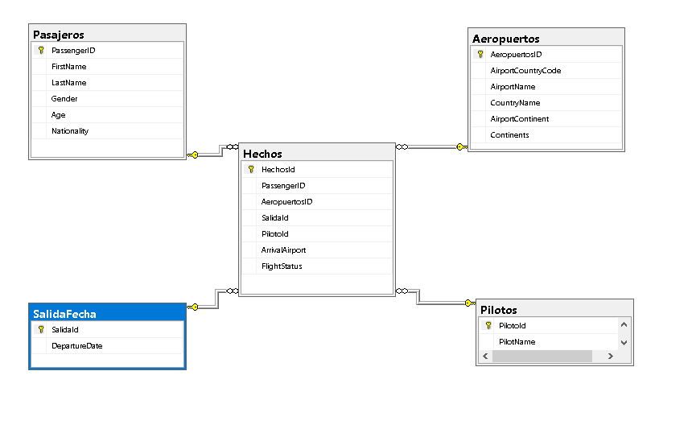

  Universidad de San Carlos de Guatemala   Facultad de Ingenieria   Escuela en Ciencias y Sistemas   Seminario de Sistemas 2   Sección A 

# Práctica 1

## Objetivos
Generales
1. Aprender el proceso de ETL
2. Brindar resultados con la información obtenida

Específicos
- Utilizar el lenguaje Python para el procesamiento de información.
- Limpiar Datos.
- Utilizar SQL Server para la creación de un Datawarehouse.
  
## Software
- SQL Server Management
- Visual studio Code, python

# Modelo de Estrella
Por la simplicidad y claridad se utilizo el model de estrella para diseñar el Datawarehouse
  

# Tabla Hechos(fact)

Contiene los datos principales que se desean analizar, como las transacciones o eventos. En tu caso, la tabla de hechos Hechos incluye información sobre los vuelos, como PassengerID, AeropuertosID, SalidaId, PilotoId, ArrivalAirport, y FlightStatus.

# Dimensiones

Proporcionan el contexto para los datos de la tabla de hechos. Las dimensiones contienen atributos descriptivos que permiten categorizar y filtrar los datos en la tabla de hechos.  
Las tablas de dimensiones son:
D1: Pasajeros 
D2: Aeropuertos 
D3: SalidaFecha 
D4: Pilotos 