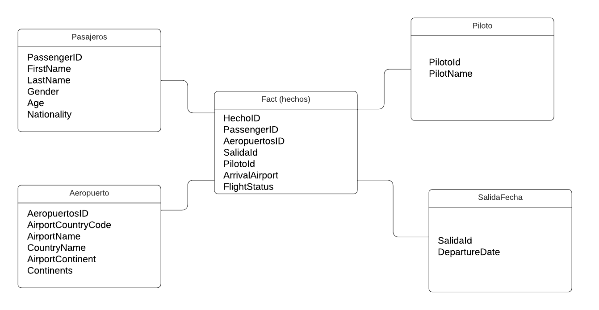

  Universidad de San Carlos de Guatemala   Facultad de Ingenieria   Escuela en Ciencias y Sistemas   Seminario de Sistemas 2   Sección A 

# Práctica 1

## Objetivos
Generales
1. Aprender el proceso de ETL
2. Brindar resultados con la información obtenida

Específicos
- Utilizar el lenguaje Python para el procesamiento de información.
- Limpiar Datos.
- Utilizar SQL Server para la creación de un Datawarehouse.
  
## Software
- SQL Server Management
- Visual studio Code, python

# Modelo de Estrella
De los datos proporcionados del archivo .csv se observo que se puede divir la información de la siguiente manera:
 
PassengerID;FirstName;LastName;Gender;Age;Nationality  
AirportName;AirportCountryCode;CountryName;AirportContinent;Continents  
DepartureDate  
ArrivalAirport  
PilotName  
FlightStatus  
 
Observando y analizando lo anterior se procedio a estructurar los datos en un modelo de estrella por la simplicidad y claridad del modelo que incluye una tabla de hechos central y varias tablas de dimensiones. Este modelo facilita las consultas y el análisis de datos.
 

  

  

# Tabla Hechos(fact)

Contiene los datos principales que se desean analizar, como las transacciones o eventos, en este caso tomamos una base de lo que se desea consultar. En este caso la tabla de hecho incluye la siguiente informacion sobre los vuelos:  
 
- HechoID
- PassengerID
- AeropuertosID
- SalidaId
- PilotoId
- ArrivalAirport
- FlightStatus.
 

La metrica de ArrivalAirport y FlightStatus la estamos tomando en la tabla de hecho como un dato sin la necesidad de relacionar con otros atributos.

# Dimensiones

Proporcionan el contexto para los datos de la tabla de hechos. Las dimensiones contienen atributos descriptivos que permiten categorizar y filtrar los datos en la tabla de hechos.   
Las dimensiones que se tomaron en cuentas son las sigueintes:  

### D1: Pasajeros 
PassengerID (llave subrogada)  
FirstName 
LastName 
Gender 
Age 
Nationality 
 

### D2: Aeropuertos  
AeropuertosID (llave subrogada) 
AirportName 
AirportCountryCode 
CountryName 
AirportContinent 
Continents 

### D3: SalidaFecha  
SalidaId (llave subrogada) 
DepartureDate 

### D4: Pilotos  
PilotoId (llave subrogada) 
PilotName 